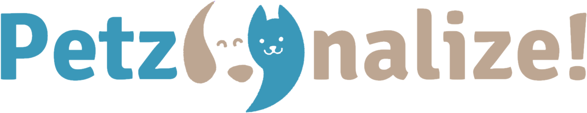

</img>

# Petzonalize!

<b>Repository for Petzonalize! Project</b>

Team Members:
<ul>
    <li>Alejandro Montellano</li>
    <li>Arath Martinez</li>
    <li>Ivan Alejandro Lopez</li>
    <li>Ixchel Navarrete</li>
    <li>Luis Enrique Sanchez</li>
    <li>Said Garcia</li>
    <li>Santiago Perez</li>
    <li>Siria Franco</li>
    <li>Steffy Denisse Alonso</li>
</ul>

# Technologies

Frontend:
<ul>
    <li>HTML</li>
    <li>CSS</li>
    <li>JavaScript</li>
    <li>Bootstrap</li>
</ul>

Backend:
<ul>
    <li>Java</li>
    <li>Spring Boot</li>
    <li>MySQL</li>
    <li>JDBC</li>
    <li>JPA</li>
    <li>Lombok</li>
    <li>Hibernate</li>
    <li>Swagger Documentation</li>
</ul>

Other:
<ul>
    <li>Visual Studio Code</li>
    <li>IntelliJ IDEA</li>
    <li>Git</li>
    <li>Postman</li>
</ul>

# Guidelines

<a target="_blank" href="https://midu.dev/buenas-practicas-escribir-commits-git/">
    Commit Messages:
</a>

<ol>
    <li>The first word will be:</li>
	<ul>
	    <li>general</li>
	    <li>front</li>
	    <li>back</li>
	</ul>
    <li>The file or section that has changed (when possible)</li>
    <li>The third word will be:</li>
	<ul>
	    <li>feat (new function or feature)</li>
	    <li>fix (bug or error fix)</li>
	    <li>docs (documentation changes)</li>
	    <li>style (changes that don't affect the code)</li>
	    <li>refact (refactor consists in rewrite code without changing the behavior)</li>
	    <li>perf (rewrite code to improves performance)</li>
	</ul>
    <li>All words must be in lowercase</li>
    <li>The words after the ":" will be the description</li>
    <li>Use "-" as separator of the first three words, and ":" as separator with the description</li>
    <li>Examples:</li>
	<ul>
	    <li>general-feat: initial folders</li>
	    <li>back-userservice-refact: get user function</li>
	    <li>front-index-fix: responsive design</li>
	</ul>
</ol>

Fonts:
<ul>
    <li><a target="_blank" href="https://fonts.google.com/specimen/Righteous">Righteous for titles</a></li>
    <li><a target="_blank" href="https://fonts.google.com/specimen/Signika+Negative">Signika Negative for content</a></li>
</ul>

<a target="_blank" href="https://coolors.co/3a98b9-fff1dc-bda692-eeeeee-73628a">
    Color Palette:
</a>

<ul>
    <li style="color: #3A98B9">#3A98B9 - Blue</li>
    <li style="color: #FFF1DC">#FFF1DC - Beige</li>
    <li style="color: #BDA692">#BDA692 - Brown</li>
    <li style="color: #EEEEEE">#EEEEEE - Gray</li>
    <li style="color: #73628A">#73628A - Purple</li>
</ul>
</img>